# L3 — 元件全貌圖

> 由 `/ca-scout` 初始化、`/ca-navigate` 重生。🔴 = 已 seed（nodes.yaml 完整 entry）；其餘為 edge 目標（尚未 seed，`/ca-navigate {模組}` 可 auto-register）。

```mermaid
flowchart TB
  subgraph shell["shell 應用外殼"]
    app["app.vue"]
    InfoContent["InfoContent"]
  end
  subgraph step["step 三步驟"]
    StepLocation["StepLocation"]
    StepCriteria["StepCriteria"]
    StepResult["StepResult"]
  end
  subgraph map["map 地圖 (deck.gl)"]
    TaiwanMap["TaiwanMap"]
    MapTooltip["MapTooltip"]
    useTaiwanMap["useTaiwanMap"]
    mapMarkers["mapMarkers"]
  end
  subgraph data["data 資料載入/運算層"]
    useGeoMeta["useGeoMeta"]
    useFilterData["useFilterData"]
    useResultTowns["useResultTowns"]
    usePopulation["usePopulation"]
    dataSource["dataSource"]
  end
  subgraph pipeline["pipeline 離線資料管線"]
    process_xlsx["process-xlsx"]
    lib_sources["lib/sources"]
  end
  subgraph ui["ui 共用元件"]
    SelectDropdown["SelectDropdown"]
    useAssets["useAssets"]
  end

  app --> StepLocation
  app --> StepCriteria
  app --> StepResult
  app --> TaiwanMap
  app --> useGeoMeta
  app --> useFilterData
  app --> useResultTowns
  app --> usePopulation
  StepLocation --> SelectDropdown
  StepResult --> InfoContent
  StepResult --> useAssets
  TaiwanMap --> useTaiwanMap
  TaiwanMap --> MapTooltip
  TaiwanMap --> mapMarkers
  useGeoMeta --> dataSource
  useFilterData --> dataSource
  usePopulation --> dataSource
  process_xlsx --> lib_sources
  process_xlsx -. "產出 public/data/*.json" .-> dataSource

  style app fill:#ff6b6b,color:#fff
  style StepResult fill:#ff6b6b,color:#fff
  style TaiwanMap fill:#ff6b6b,color:#fff
  style useResultTowns fill:#ff6b6b,color:#fff
  style useGeoMeta fill:#ff6b6b,color:#fff
  style dataSource fill:#ff6b6b,color:#fff
  style process_xlsx fill:#ff6b6b,color:#fff
  style SelectDropdown fill:#ff6b6b,color:#fff
```

**資料流向**：`pipeline`（離線 xlsx→JSON）產出 `public/data/*` → `data` 層（`dataSource` + composables）執行期載入 → `app` 注入 `step` 與 `map` 呈現。
